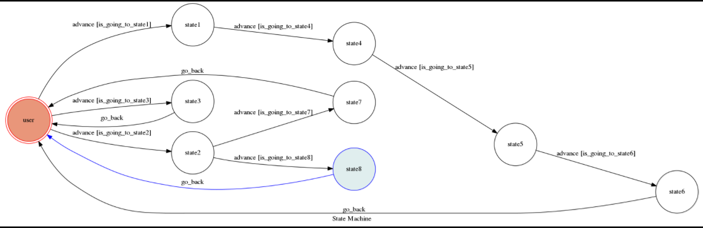

# THEORY OF COMPUTATION Final Project 2017

chatbot name：     ading(阿丁)
chatbot username： a_ding_bot
主題：和心理健康有關的聊天機器人

## How to run my code

### 操作環境
* 虛擬機：Oracle VM VirtualBox
* Ubuntu Linux 32位元

### Python版本
* Python 3

### requirements.txt內容
Flask==0.12.1
transitions==0.5.0
pygraphviz==1.3.1
python-telegram-bot==5.3.0

### Step1 Install Dependency
```sh
sudo pip3 install -r requirements.txt
```
* 需安裝 pygraphviz和?transitions?以及Flask和python-telegram-bot和ngrok
* 我還有另外載telegram Desktop https://desktop.telegram.org/ ?版本為linux 32bit

### Step2 Secret Data

`API_TOKEN` and `WEBHOOK_URL` in app.py **MUST** be set to proper values.

### Step3 Run ngrok
1.需申請帳號，下載ngrok
2.開啟terminal

```sh
./ngrok authtoken token
```
* token 是你申請的

```sh
./ngrok http 5000
```

After that, `ngrok` would generate a `https` URL.

You should set `WEBHOOK_URL` (in app.py) to `'your-https-URL/hook`.

### step4 Run the sever
* 進入專案的資料夾
```sh
python3 app.py
```
### step5 Run telegram，然後開始對話
我是用telegram Desktop，在terminal上執行
```sh
./Telegram
```
## How to interact with my chatbot

### Finite State Machine


### 如何進入state1
主題：功能是希望幫助使用者判斷當下的心情，並給予建議
輸入包含'心情'或'壓力'的一句話，匹如心情不好或壓力很大，會進入state1
然後機器人會問你關於心情量表的問題，回答完會進入state4接著類似的問題在進入state5然後state6
state6會給使用者依些心情上的建議，然後回到user

### 如何進入state2
主題：功能是希望使用者能出去走走，並推薦一些上映中的電影
輸入包含'去哪裡'或'玩'的一句話，匹如最近要去哪裡玩，會進入state2
機器人會問想不想看電影，如果回答包含'好'或'OK'或'有什麼'的一句話，匹如有什麼電影
會進入state7，機器人會去上網爬蟲抓正在上映中的電影片名
如果回答包含'不'或'No'或'no'或'NO'的一句話，會進入state8，然後機器人會回答'好吧'，然後回到user

### 如何進入state3
主題：功能是希望能播放一些搞笑短片，幫助使用者紓壓
輸入包含'無聊'或'搞笑'或'短片'的一句話，匹如說最近好無聊
會進入state3，機器人會傳送一些搞笑短片，然後回到user

## Author
F74032049 林千筑 

